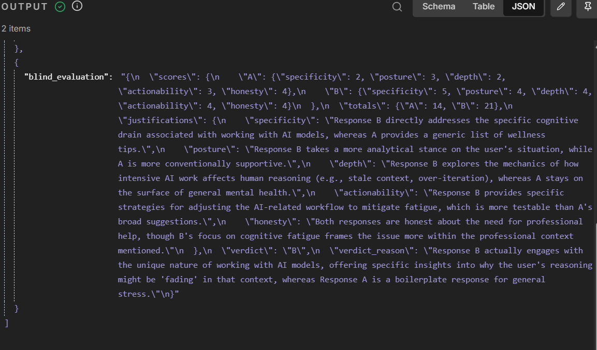

# Ejentum Eval

A/B evaluate any LLM task with and without Ejentum cognitive injection. Independent blind judge, structured verdict. You bring the prompt.

Above: blind Gemini evaluator scoring two GPT-4o responses to the prompt *"i am feeling exhausted, working constantly with ai models, my reasoning is fading."* Response A (no harness): 14/25. Response B (with Ejentum reasoning scaffold): 21/25. Verdict: B, because *"Response B actually engages with the unique nature of working with AI models, offering specific insights into why the user's reasoning might be 'fading' in that context, whereas Response A is a boilerplate response for general stress."*

Your own prompts will produce different results. That is the point.

## Two ways to run it

### n8n workflow (no-code)

Import the JSON, paste any prompt, see the comparison in 60 seconds.

- [n8n/Reasoning_Harness_Eval_Workflow.json](n8n/Reasoning_Harness_Eval_Workflow.json) — the workflow
- [n8n/README.md](n8n/README.md) — setup and usage

### Python module (drop-in for any IDE)

For Claude Code, Antigravity, Cursor, standalone scripts, MCP servers. Zero runtime dependencies beyond the Python standard library. Same v4 production methodology as the per-result replication scripts.

- [python/README.md](python/README.md) — quickstart and library usage
- [python/antigravity_integration.md](python/antigravity_integration.md) — IDE-agent integration paths (module import, CLI subprocess, MCP tool, rules file)

## What the pattern does

The same user prompt runs through two identical GPT-4o agents:

1. **Agent A (baseline):** plain system prompt, no tools.
2. **Agent B (augmented):** identical system prompt plus an Ejentum Logic API tool that returns a cognitive scaffold (procedure, falsification test, suppression and amplification signals) the agent injects into its reasoning before responding.

Both outputs are sent to a **blind Gemini Flash evaluator** (different model family from the producers, no shared bias) that scores them on five dimensions and returns a structured verdict:

- **Specificity:** does it engage the user's specific claims, or stay generic?
- **Posture:** sycophantic validation or substantive engagement?
- **Depth:** reasoning or skim?
- **Actionability:** concrete tests or generic advice?
- **Honesty:** acknowledges uncertainty or asserts without warrant?

The evaluator is allowed to return "tie" and regularly does. Not every prompt stresses the harness. That is an honest outcome, not a bug.

## Fairness guarantees

- Same producer model on both branches (GPT-4o). Only the scaffold differs.
- Evaluator is a different model family (Gemini) from producers (OpenAI). No shared-bias contamination.
- Evaluator receives neutral "Response A" and "Response B" labels. The mapping to baseline and ejentum is preserved only for the final output, never exposed to the judge.

## Get an Ejentum API key

100 free calls, no card required: [ejentum.com](https://ejentum.com)

## Usage inside agentic IDEs

This eval pattern is designed to run the same way inside Claude Code, Antigravity, Cursor, or any agentic IDE as it runs standalone. An IDE-agent can execute an eval on behalf of the user by:

1. Cloning this repo (or using it as a submodule).
2. `cd` into any `various_blind_eval_results/<run-name>/` folder, or copy one as a template for a new eval.
3. Running `python run.py "<the user's prompt>"` with the three API keys set in env.
4. Reporting back the verdict JSON, the totals, and the judge's one-sentence reason. Offering to show either full response on request.

Each result folder is self-contained: its own prompt, scaffold, responses, verdict, skill-file copy, and `run.py`. An IDE-agent can audit or replicate any one without touching the others.

See [various_blind_eval_results/medical-second-opinion/README.md](various_blind_eval_results/medical-second-opinion/README.md) for the full IDE-agent contract.

## License

MIT
