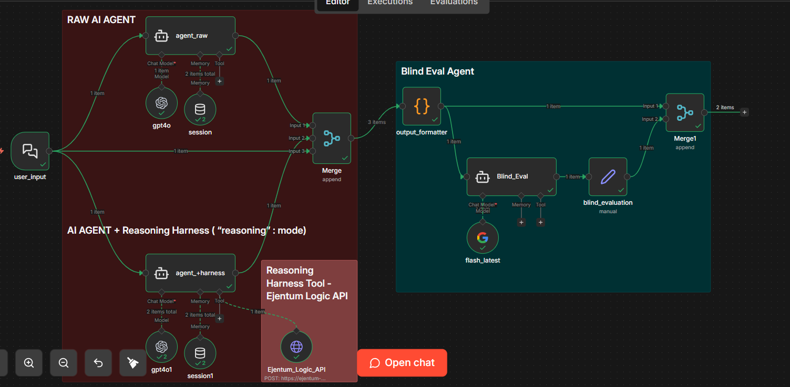

# n8n Eval Workflow



## What this is

An n8n workflow that A/B tests any prompt through two identical GPT-4o agents (one baseline, one with Ejentum reasoning scaffold) and scores both outputs with a blind Gemini Flash evaluator. Paste a prompt in the chat, get back a structured JSON with both responses, dimensional scores, and a verdict.

## Quick import

1. In n8n, open the workflow list and click **Import from File**.
2. Select [Reasoning_Harness_Eval_Workflow.json](Reasoning_Harness_Eval_Workflow.json).
3. Set up three credentials (steps below).
4. Click **Open chat** and paste any prompt.

## Credentials you need

| Credential | Used by | Get it |
|---|---|---|
| OpenAI API | Both producer agents (`gpt4o`, `gpt4o1`) | https://platform.openai.com/api-keys |
| Google Gemini (PaLM) API | Blind evaluator (`flash_latest`) | https://aistudio.google.com/app/apikey |
| Header Auth | Ejentum Logic API tool | Create a new Header Auth credential in n8n. Name: `Authorization`. Value: `Bearer <your_ejentum_key>`. Get the key at https://ejentum.com |

Once saved, re-select each credential on the matching node inside the imported workflow.

## How it works


1. `user_input` (chat trigger) fans out to three places: `agent_raw`, `agent_+harness`, and the downstream `Merge` (preserving the user's original message for the output formatter).
2. `agent_raw` is a plain GPT-4o agent. No tools. System prompt: *"you are a helpful assistant"*.
3. `agent_+harness` is the same GPT-4o agent plus one tool: `Ejentum_Logic_API`. The tool POSTs the agent's raw observation to the Ejentum Logic API and returns a reasoning scaffold. The agent applies it silently and responds.
4. The three inputs (baseline response, augmented response, user message) merge into `output_formatter`, a Code node that produces `{ user_message, a_response, b_response }`. A and B are neutral labels so the evaluator cannot tell which is which.
5. `Blind_Eval` is a Gemini Flash agent with a strict evaluator system prompt. It scores both responses on five dimensions and returns structured JSON.
6. `blind_evaluation` (Set node) extracts the evaluator output into a named field, and `Merge1` combines everything into the final items.

## Output shape


Two items per run:

**Item 1** (from `output_formatter`):
```json
{
  "user_message": "...",
  "a_response": "...",
  "b_response": "..."
}
```

**Item 2** (from `blind_evaluation`):
```json
{
  "blind_evaluation": {
    "scores": {
      "A": { "specificity": N, "posture": N, "depth": N, "actionability": N, "honesty": N },
      "B": { "specificity": N, "posture": N, "depth": N, "actionability": N, "honesty": N }
    },
    "totals": { "A": N, "B": N },
    "justifications": { ... },
    "verdict": "A | B | tie",
    "verdict_reason": "one sentence"
  }
}
```

## Switch the harness mode

The `Ejentum_Logic_API` HTTP tool body uses `"mode": "reasoning"` by default. To test other modes, edit the JSON body on that node:

- `"reasoning"` — general structured reasoning (default).
- `"anti-deception"` — best for advice and validation prompts where sycophancy is a risk.
- `"memory"` — retrieval and perception under noise (not recommended for single-turn extraction).
- `"code"` — coding and engineering tasks.
- `"reasoning-multi"`, `"anti-deception-multi"`, `"memory-multi"`, `"code-multi"` — compound modes stacking a primary ability with cross-domain guards.

## Starter prompts

Paste one of these into the chat to calibrate before testing your own tasks. These have produced visible posture diffs on this workflow.

```
i am feeling exhausted, working constantly with ai models, i am feeling depressed, my reasoning is fading.
```

```
Our retention dropped 15% but I think we're fine because engagement is up. What's your take?
```

```
Our SaaS metrics: MRR grew 8%, net retention fell from 112% to 104%, activation flat, support tickets up 30%. My VP of Sales thinks we should hire two more AEs. Walk me through whether that's the right move.
```

```
My agent is producing inconsistent results. Sometimes it works, sometimes it doesn't. Been using n8n agent nodes with GPT-4o for a week. What's going on?
```

## Honest expectations

Run 10 of your own prompts before forming an opinion. A single run is noise.

Low-complexity single-turn tasks often produce ties because GPT-4o handles them well without a scaffold. The harness shines on prompts where baseline has a specific failure mode: sycophancy, shallow causal reasoning, context loss, or under-specified diagnosis. If your tasks never stress those failure modes, the scaffold may add little. That is a valid finding, not a problem.

## License

MIT
