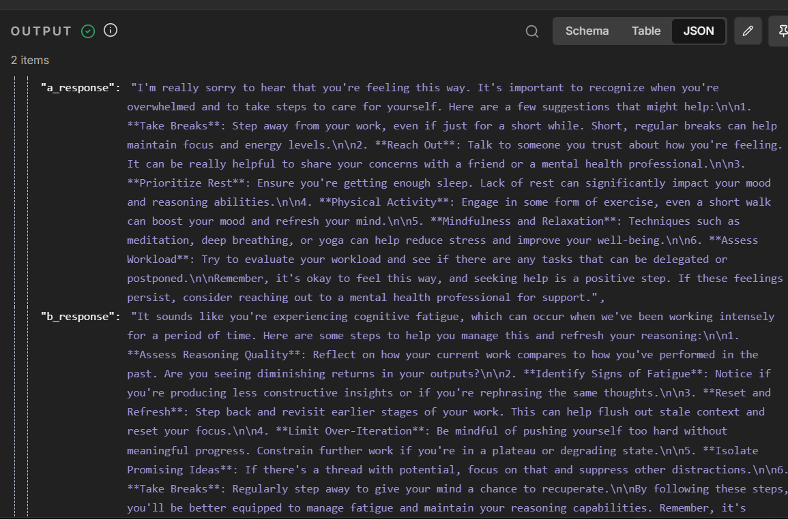

# n8n Single-Turn Producer-Injection Eval


## What this is

The original single-turn A/B pattern. A chat-triggered n8n workflow that takes one user prompt, runs it through two identical GPT-4o agents (one baseline, one with an Ejentum cognitive scaffold injected directly into the augmented agent's context), and scores both responses with a blind Gemini Flash evaluator on five dimensions.

Unlike the [agent_vs_agent_multi_turn](../agent_vs_agent_multi_turn/) workflow, this one does not loop, does not persist to a data table, and does not score drift resistance or pattern enumeration across turns. One prompt in, structured verdict out, in under a minute.

Best when you want a quick posture comparison on a specific prompt without building a multi-turn scenario.

## Status

The workflow JSON for this pattern is maintained outside this subfolder. To add it back in, drop the exported JSON (previously `Reasoning_Harness_Eval_Workflow.json`) into this directory and update the import link below.

The full pattern specification this workflow implements is in [../../spec.md](../../spec.md). The Python drop-in port of the same pattern lives in [../../python/](../../python/).

## Output shape (blind evaluator, 5-dimension rubric)


```json
{
  "scores": {
    "A": { "specificity": N, "posture": N, "depth": N, "actionability": N, "honesty": N },
    "B": { "specificity": N, "posture": N, "depth": N, "actionability": N, "honesty": N }
  },
  "totals": { "A": N, "B": N },
  "justifications": { "...per-dimension comparison..." },
  "verdict": "A | B | tie",
  "verdict_reason": "one sentence"
}
```

Max score per agent is 25 (five dimensions, 1-5 integer).

## How the A/B split is wired



1. `user_input` (chat trigger) fans out to three places: baseline agent, augmented agent, and the downstream formatter (preserving the user's original message).
2. `agent_raw` is a plain GPT-4o agent, no tools, minimal system prompt.
3. `agent_+harness` is the same GPT-4o agent plus one HTTP tool: `Ejentum_Logic_API`. The tool returns a cognitive scaffold the agent applies silently before responding.
4. Both outputs plus the user message merge into the formatter, labeled neutrally as A and B.
5. `Blind_Eval` (Gemini Flash) scores both responses on the five-dimension rubric blind.

The rubric lives entirely in the `Blind_Eval` system prompt; swap the judge model without changing the scoring logic.

## Pattern specification

For the host-agnostic pattern definition (roles, fairness requirements, intentional non-goals), see [../../spec.md](../../spec.md). For a Python port with zero runtime dependencies, see [../../python/](../../python/).

## Sample result

A single-turn Python port of this pattern produced [`../../various_blind_eval_results/medical-second-opinion/`](../../various_blind_eval_results/medical-second-opinion/), which uses the same scaffold-injection pattern and the same five-dimension rubric.
